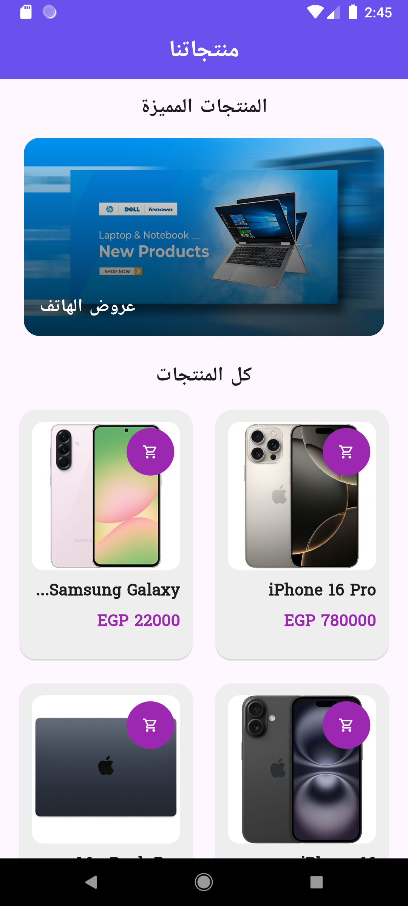
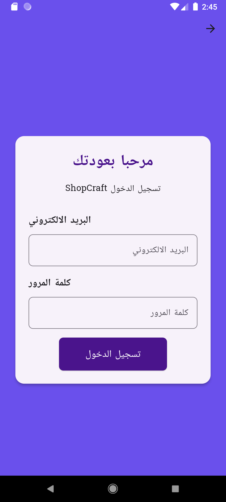
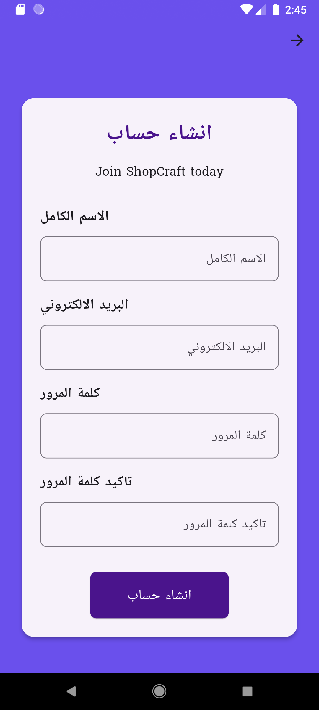

# 🛍️ ShopCraft - E-Commerce Flutter App

**ShopCraft** is a modern, responsive e-commerce mobile application built with **Flutter** and **Dart**, designed to showcase products, offers, and promotions in a clean and intuitive UI. It features localization, JSON-based data loading, and beautiful animations.

> 🌍 Available in multiple languages with `easy_localization`.

---

## 📸 Screenshots

| Home Screen | Welcome Screen | Sign In | Sign Up |
|-------------|----------------|---------|---------|
|  |  |  |  |

## ✨ Features

- ✅ Responsive & Clean UI
- ✅ Product listing with `GridView`
- ✅ Featured banners with `PageView`
- ✅ Hot offers carousel
- ✅ JSON-based product data loading
- ✅ Localization (Multi-language support via `easy_localization`)
- ✅ Gradient-styled promotional widgets
- ✅ Custom reusable widgets (e.g., `ProductCard`, `HotOfferItem`, `PromoCard`)
- ✅ Light and smooth performance

---

## 🧰 Technologies Used

- **Flutter** – Cross-platform UI framework
- **Dart** – Programming language
- **easy_localization** – For multi-language support
- **JSON** – Mock data storage
- **Material Design** – UI components

---

## 🚀 Getting Started

### 1. Clone the Repository

git clone https://github.com/Samah-Osama/shop_craft.git
cd shop_craft

### 2 .Install Dependencies

flutter pub get
### 3 .Run the App
